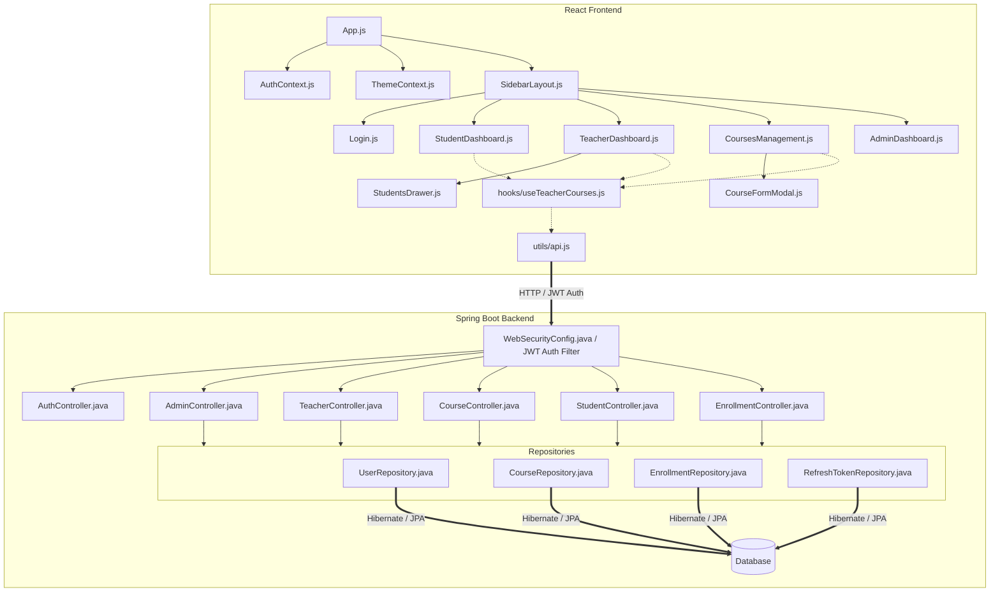
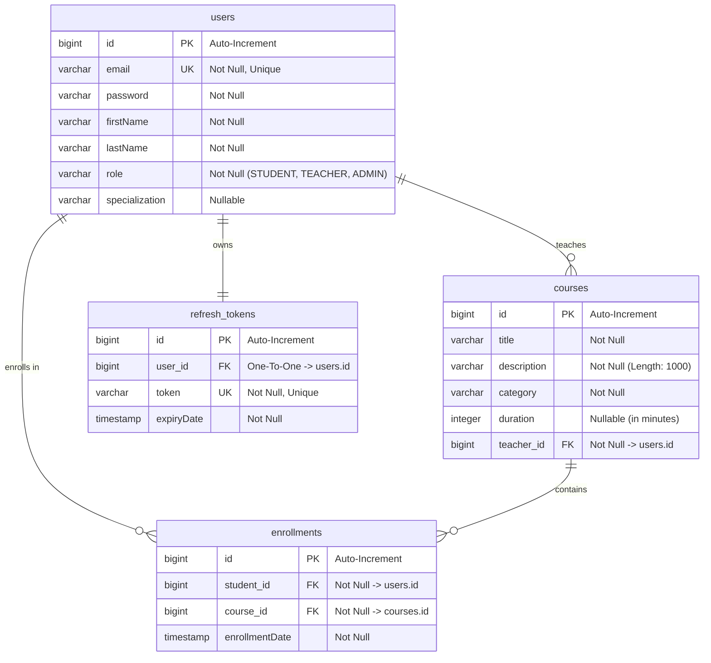

# School Management Platform (Santhosh LMS) - Codebase & Database Documentation

This document describes the overall system architecture, file structure, and database schema design for the Santhosh Learning Management System (LMS) Platform.

---

## 1. System Architecture Diagram

The flow of requests and component layout across the Frontend, Network Boundary, and Backend is illustrated below:

---

## 2. Database Schema Design

The entity relationships and schemas are implemented using Spring Data JPA. Below is the Entity-Relationship (ER) diagram followed by a column-by-column breakdown:

### Entity-Relationship (ER) Diagram

### Table Definitions & Column Details

#### A. Table: `users`
Represents all system actors (Students, Instructors, and Administrators).
*   **`id`** (`bigint`, PK, Identity): Primary key.
*   **`email`** (`varchar`, Unique, Not Null): E-mail address used for user authentication.
*   **`password`** (`varchar`, Not Null): Brypt-hashed authentication credential.
*   **`firstName`** (`varchar`, Not Null): User's first name.
*   **`lastName`** (`varchar`, Not Null): User's last name.
*   **`role`** (`varchar`, Not Null): Roles matching `STUDENT`, `TEACHER`, or `ADMIN`.
*   **`specialization`** (`varchar`, Nullable): Teacher-specific field indicating their subject expertise area.

#### B. Table: `courses`
Stores academic courses created by teachers.
*   **`id`** (`bigint`, PK, Identity): Primary key.
*   **`title`** (`varchar`, Not Null): The title of the course.
*   **`description`** (`varchar(1000)`, Not Null): Summary explaining the syllabus and objectives.
*   **`category`** (`varchar`, Not Null): Subject cluster tag (e.g. Computer Science, Physics).
*   **`duration`** (`int`, Nullable): Total instruction duration (in minutes).
*   **`teacher_id`** (`bigint`, FK, Not Null): Foreign key pointing to `users.id` (corresponds to the teaching instructor).

#### C. Table: `enrollments`
Tracks the many-to-many relationship of students joining courses.
*   **`id`** (`bigint`, PK, Identity): Primary key.
*   **`student_id`** (`bigint`, FK, Not Null): Foreign key pointing to `users.id` (corresponds to the student).
*   **`course_id`** (`bigint`, FK, Not Null): Foreign key pointing to `courses.id`.
*   **`enrollmentDate`** (`timestamp`, Not Null): Timestamp recording the precise enrollment moment.
*   *Note*: A compound unique constraint enforces that `(student_id, course_id)` is unique to prevent duplicate enrollments.

#### D. Table: `refresh_tokens`
Stores active token rotation credentials for session persistence.
*   **`id`** (`bigint`, PK, Identity): Primary key.
*   **`user_id`** (`bigint`, FK, One-to-One): Foreign key linking directly to the owner's `users.id`.
*   **`token`** (`varchar`, Unique, Not Null): Token rotation string.
*   **`expiryDate`** (`timestamp`, Not Null): Expiry time.

---

## 3. Backend Files Summary (`/backend/src/main/java/com/example/backend`)

### Core Entry Point
*   **[`BackendApplication.java`](file:///c:/Users/ASUS/OneDrive/Documents/Project/final_project/backend/src/main/java/com/example/backend/BackendApplication.java)**: The entry point configuring Spring Boot and component scans.

### Configuration Layer (`/config`)
*   **[`DatabaseSeeder.java`](file:///c:/Users/ASUS/OneDrive/Documents/Project/final_project/backend/src/main/java/com/example/backend/config/DatabaseSeeder.java)**: Performs automatic schema seeding on bootstrap (creates test admins, teachers, students, and dummy courses).

### Controllers Layer (`/controller`)
*   **[`AuthController.java`](file:///c:/Users/ASUS/OneDrive/Documents/Project/final_project/backend/src/main/java/com/example/backend/controller/AuthController.java)**: Performs user registration, login JWT set-cookie, and token refreshes.
*   **[`CourseController.java`](file:///c:/Users/ASUS/OneDrive/Documents/Project/final_project/backend/src/main/java/com/example/backend/controller/CourseController.java)**: REST controls for course operations (creation, updates, deletes, catalog querying).
*   **[`TeacherController.java`](file:///c:/Users/ASUS/OneDrive/Documents/Project/final_project/backend/src/main/java/com/example/backend/controller/TeacherController.java)**: Scopes student lookup details of a teacher's course roster.
*   **[`StudentController.java`](file:///c:/Users/ASUS/OneDrive/Documents/Project/final_project/backend/src/main/java/com/example/backend/controller/StudentController.java)**: Feeds profile state queries, profile updates, and lists personal class schedules.
*   **[`EnrollmentController.java`](file:///c:/Users/ASUS/OneDrive/Documents/Project/final_project/backend/src/main/java/com/example/backend/controller/EnrollmentController.java)**: Controls course registration additions and dropping schedules.
*   **[`AdminController.java`](file:///c:/Users/ASUS/OneDrive/Documents/Project/final_project/backend/src/main/java/com/example/backend/controller/AdminController.java)**: Delivers statistics analytics and handles teacher CRUD profile logic.

### Repositories Layer (`/repository`)
*   **[`UserRepository.java`](file:///c:/Users/ASUS/OneDrive/Documents/Project/final_project/backend/src/main/java/com/example/backend/repository/UserRepository.java)**: Connects database actions to the `users` table.
*   **[`CourseRepository.java`](file:///c:/Users/ASUS/OneDrive/Documents/Project/final_project/backend/src/main/java/com/example/backend/repository/CourseRepository.java)**: Filters course catalogs by searching strings or specific teacher lists.
*   **[`EnrollmentRepository.java`](file:///c:/Users/ASUS/OneDrive/Documents/Project/final_project/backend/src/main/java/com/example/backend/repository/EnrollmentRepository.java)**: Queries user count indicators and student enrollment mappings.
*   **[`RefreshTokenRepository.java`](file:///c:/Users/ASUS/OneDrive/Documents/Project/final_project/backend/src/main/java/com/example/backend/repository/RefreshTokenRepository.java)**: Fetches and deletes database refresh credentials.

### Models Layer (`/model`)
*   **[`User.java`](file:///c:/Users/ASUS/OneDrive/Documents/Project/final_project/backend/src/main/java/com/example/backend/model/User.java)**: Represents details of administrative, teacher, or student records.
*   **[`Course.java`](file:///c:/Users/ASUS/OneDrive/Documents/Project/final_project/backend/src/main/java/com/example/backend/model/Course.java)**: Represents course data properties.
*   **[`Enrollment.java`](file:///c:/Users/ASUS/OneDrive/Documents/Project/final_project/backend/src/main/java/com/example/backend/model/Enrollment.java)**: Schema details for a course enrollment.
*   **[`RefreshToken.java`](file:///c:/Users/ASUS/OneDrive/Documents/Project/final_project/backend/src/main/java/com/example/backend/model/RefreshToken.java)**: Schema details for a user's refresh token.
*   **[`Role.java`](file:///c:/Users/ASUS/OneDrive/Documents/Project/final_project/backend/src/main/java/com/example/backend/model/Role.java)**: Simple enumerator class containing: `STUDENT`, `TEACHER`, and `ADMIN`.

### Security Layer (`/security`)
*   **[`WebSecurityConfig.java`](file:///c:/Users/ASUS/OneDrive/Documents/Project/final_project/backend/src/main/java/com/example/backend/security/WebSecurityConfig.java)**: Maps CORS rules, route filters, and configures password hashing beans.
*   **[`JwtUtils.java`](file:///c:/Users/ASUS/OneDrive/Documents/Project/final_project/backend/src/main/java/com/example/backend/security/JwtUtils.java)**: Formats, signs, and extracts JWT strings.
*   **[`JwtAuthFilter.java`](file:///c:/Users/ASUS/OneDrive/Documents/Project/final_project/backend/src/main/java/com/example/backend/security/JwtAuthFilter.java)**: Extracts cookie values to load user details in Spring's Security context.
*   **[`UserDetailsImpl.java`](file:///c:/Users/ASUS/OneDrive/Documents/Project/final_project/backend/src/main/java/com/example/backend/security/UserDetailsImpl.java)**: Implements Spring Security's `UserDetails` wrapper mapping authorization roles.
*   **[`UserDetailsServiceImpl.java`](file:///c:/Users/ASUS/OneDrive/Documents/Project/final_project/backend/src/main/java/com/example/backend/security/UserDetailsServiceImpl.java)**: Loads user details from database by email.
*   **[`RefreshTokenService.java`](file:///c:/Users/ASUS/OneDrive/Documents/Project/final_project/backend/src/main/java/com/example/backend/security/RefreshTokenService.java)**: Rotates and checks database session tokens.
*   **[`AuthEntryPointJwt.java`](file:///c:/Users/ASUS/OneDrive/Documents/Project/final_project/backend/src/main/java/com/example/backend/security/AuthEntryPointJwt.java)**: Returns `401 Unauthorized` for failed security checks.

---

## 4. Frontend Files Summary (`/frontend/src`)

### Architecture Entry Points
*   **[`index.js`](file:///c:/Users/ASUS/OneDrive/Documents/Project/final_project/frontend/src/index.js)**: Boots React and mounts components into the web page document.
*   **[`App.js`](file:///c:/Users/ASUS/OneDrive/Documents/Project/final_project/frontend/src/App.js)**: Configures query clients, providers (theme + authentication contexts), route paths, and redirects.
*   **[`tailwind.css`](file:///c:/Users/ASUS/OneDrive/Documents/Project/final_project/frontend/src/tailwind.css)**: Precompiled stylesheet incorporating design system spacing and dark-mode styles.

### Component Layer (`/components`)
*   **[`SidebarLayout.js`](file:///c:/Users/ASUS/OneDrive/Documents/Project/final_project/frontend/src/components/SidebarLayout.js)**: Renders the standard desktop and mobile navigation layouts, showing profile details, theme switcher controls, and sign-out controls.
*   **[`ProtectedRoute.js`](file:///c:/Users/ASUS/OneDrive/Documents/Project/final_project/frontend/src/components/ProtectedRoute.js)**: Guards routing by cross-checking permissions and redirecting users.
*   **[`CourseFormModal.js`](file:///c:/Users/ASUS/OneDrive/Documents/Project/final_project/frontend/src/components/CourseFormModal.js)**: Modal overlay with Yup validation rules, allowing teachers to create or edit courses.
*   **[`StudentsDrawer.js`](file:///c:/Users/ASUS/OneDrive/Documents/Project/final_project/frontend/src/components/StudentsDrawer.js)**: Sidebar showing the students enrolled in a selected course.
*   **[`Toast.js`](file:///c:/Users/ASUS/OneDrive/Documents/Project/final_project/frontend/src/components/Toast.js)**: Alert banners informing users of successes or errors.

### Global State Contexts (`/context`)
*   **[`AuthContext.js`](file:///c:/Users/ASUS/OneDrive/Documents/Project/final_project/frontend/src/context/AuthContext.js)**: Distributes user state info and actions (`login`, `logout`, state updates) across the React tree.
*   **[`ThemeContext.js`](file:///c:/Users/ASUS/OneDrive/Documents/Project/final_project/frontend/src/context/ThemeContext.js)**: Handles dark mode preference settings and writes configurations to local storage.

### Custom React-Query Hooks (`/hooks`)
*   **[`useTeacherCourses.js`](file:///c:/Users/ASUS/OneDrive/Documents/Project/final_project/frontend/src/hooks/useTeacherCourses.js)**: Bundles server state queries and mutation operations (listing, creating, updating, and deleting courses).

### Shared Utilities (`/utils`)
*   **[`api.js`](file:///c:/Users/ASUS/OneDrive/Documents/Project/final_project/frontend/src/utils/api.js)**: Configures Axios with base URLs, attaches security headers, and intercepts responses to request token updates automatically upon encountering status codes of `401`.

### Page Views (`/pages`)
*   **[`Login.js`](file:///c:/Users/ASUS/OneDrive/Documents/Project/final_project/frontend/src/pages/Login.js)**: Card-based authentication page.
*   **[`StudentDashboard.js`](file:///c:/Users/ASUS/OneDrive/Documents/Project/final_project/frontend/src/pages/StudentDashboard.js)**: Student interface for catalog browsing, course registration, and self-profile updates.
*   **[`TeacherDashboard.js`](file:///c:/Users/ASUS/OneDrive/Documents/Project/final_project/frontend/src/pages/TeacherDashboard.js)**: Metrics dashboard showing course lists, enrollment counts, and student roster views.
*   **[`CoursesManagement.js`](file:///c:/Users/ASUS/OneDrive/Documents/Project/final_project/frontend/src/pages/CoursesManagement.js)**: CRUD list panel for teacher course catalog adjustments.
*   **[`AdminDashboard.js`](file:///c:/Users/ASUS/OneDrive/Documents/Project/final_project/frontend/src/pages/AdminDashboard.js)**: Administrator portal for monitoring general activity metrics and CRUD modifications for teaching staff.
*   **[`Unauthorized.js`](file:///c:/Users/ASUS/OneDrive/Documents/Project/final_project/frontend/src/pages/Unauthorized.js)**: Error screen when users attempt to cross-navigate restricted directories.
